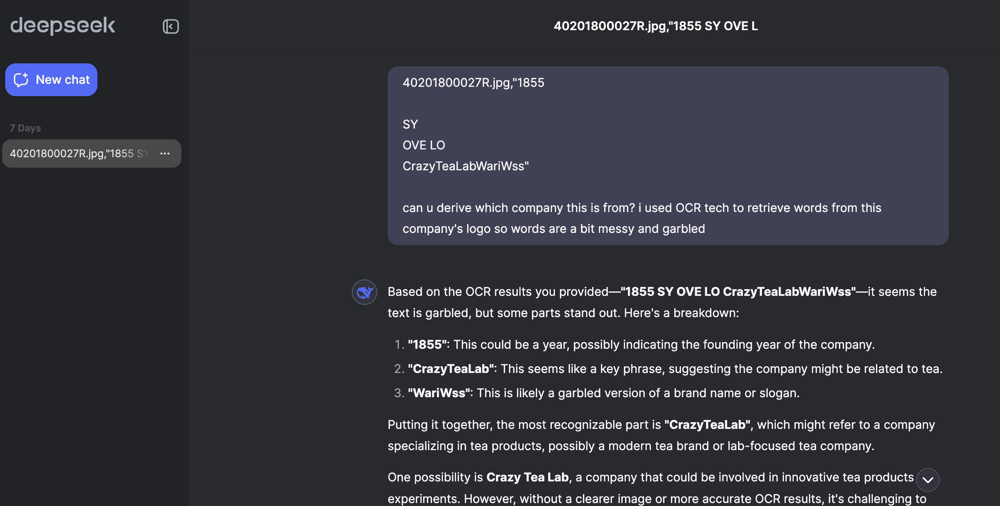
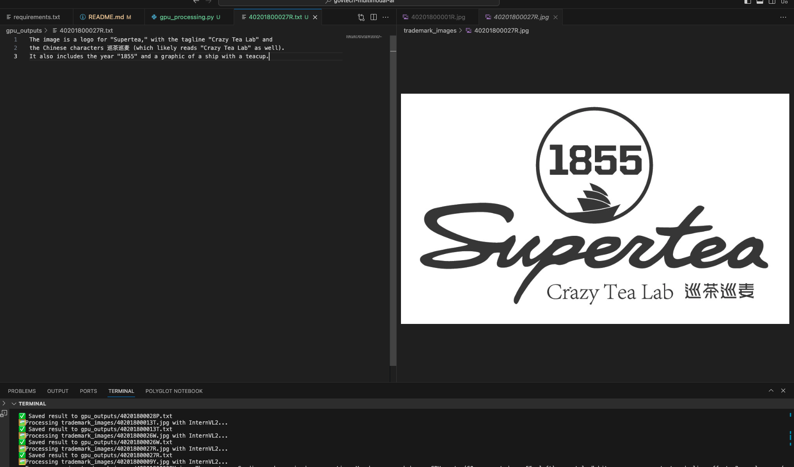
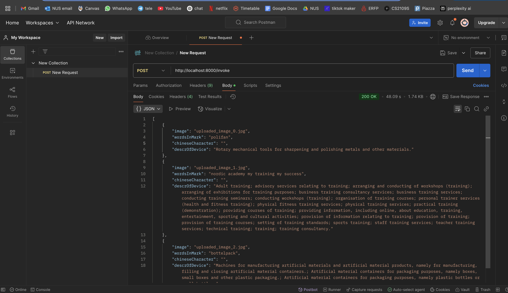
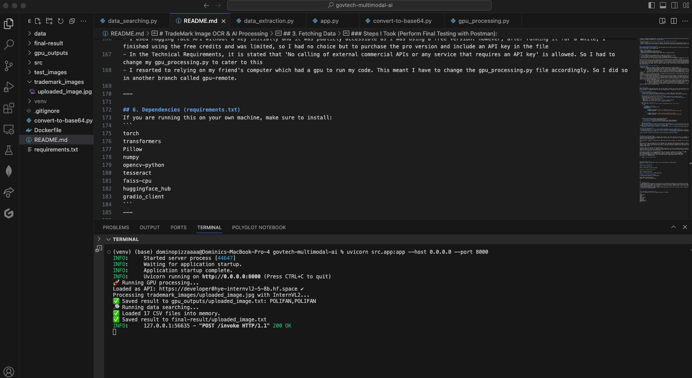

# TradeMark Image OCR & AI Processing

## Table of Contents
- [Project Overview](#project-overview)
- [CPU Processing](#cpu-processing)
  - [Try 1: EasyOCR](#try-1-easyocr)
  - [Try 2: Tesseract OCR](#try-2-tesseract-ocr)
- [GPU-Based Processing](#gpu-based-processing)
  - [Qwen](#qwen)
  - [InternVL2](#internvl2)
- [Hugging Face API](#hugging-face-api)
- [How to Run on Your Computer](#how-to-run-on-your-computer)
- [Final Thoughts](#final-thoughts)
  - [Deep Understanding of OCR & Multimodal AI](#1-deep-understanding-of-ocr--multimodal-ai)
  - [GPU vs CPU Performance Optimization](#2-gpu-vs-cpu-performance-optimization)
  - [Building a Scalable AI Pipeline](#3-building-a-scalable-ai-pipeline)
  - [Discovering My Interest in Computer Vision](#4-discovering-my-interest-in-computer-vision)

## Project Overview
I started this project to explore multimodal AI processing for extracting text from trademark images. Initially, I thought of using traditional OCR, but I quickly realized that some images had stylized fonts, distortions, and even non-Latin characters.

To improve accuracy, I researched different CPU and GPU-based models to process images and extract text. This repository contains my journey through different approaches.

I will first discuss CPU processing, then GPU

---

## CPU Processing
At first, I wanted to test image OCR using only CPU resources. Since my laptop does not have a GPU, I looked for efficient methods to extract text without requiring heavy computation.

### Try 1: EasyOCR
#### Technologies Used
- EasyOCR for text extraction
  - Supports both English and Chinese text recognition
- PyTorch as backend for EasyOCR's deep learning mode
- OpenCV for image preprocessing
- FAISS index to store image features

#### Challenges Faced in using EasyOCR
- Low accuracy
  - Misread a some English letters and Chinese characters
  - Struggled to read smaller text
- Slow processing
- Inconsistent formatting

#### Accuracy achieved (EasyOCR): Defined as getting the output without extra characters
- First try: 10/28 (I decided to move on and try other technologies first)
---

### Try 2: Tesseract OCR
#### Technologies Used
- Tesseract OCR for text extraction
  - Converts images to grayscale and applies noise reduction
  - Uses adaptive thresholding to enhance text contrast
- OpenCV for image preprocessing
- ResNet18 for feature extraction
  - Uses a pretrained ResNet18 model to extract deep image features
  - Outputs a feature vector for each image
- FAISS index to store image features

#### Challenges Faced in using Tesseract
- OCR was not accurate enough – many extracted texts had errors.
- Processing speed was fine, but text extraction quality needed improvement.
- I realised that some of the outputs have the actual word, but there are many redundant words like for example: "a LES ay 13pm VG vo 2 WW IN BA las ef any iz a is S sf ms Bx a 44tee s4 fL TtsIPNA AYE eModernChinaTeaShop" when the actual word is ModernChinaTeaShop.

I realised that I could potentially use Deepseek model to refine the output so I tested it out on deepseek to see if it could derive the Mark Name with the garbage that comes with the output: 



As seen, using deepseek works, so i tried to incorporate deepseek into my model. However, while running the output and after many iterations of trying different versions of deepseek from hugging face, it took way too much time to process the output and clean up the final text (much more than allowed) so i decided that proceeding with gpu-processing will be a better option

#### Accuracy achieved (Tesseract OCR): Defined as getting the output without extra characters
- First try: 13/28
- Second try (Improved OCR preprocessing with adaptive thresholding, Gaussian blur, and character whitelist): 15/28
- Third try (Forgot that I had to account for chinese charcters too (brew install tesseract-lang)): 15/28 no change

#### From here, I decided to move on and try using GPU first, since the accuracy of both OCRs were so low.
---

## GPU-Based Processing
Since CPU-based OCR was not sufficient, I researched models that use GPU acceleration for better text extraction in hugging face. Some of the models I found were Qwen, InternVL2, etc. In the end, I choose InternVL2. I will describe my process below.

#### To Note: Initially, I used Hugging Face's free GPU trial to process my images. However, after exhausting the free credits, I upgraded to the Pro version for the remainder of the project. To ensure the project runs smoothly on any setup, I will make a final adjustment to gpu_processing.py to enable local GPU processing instead of relying on Hugging Face's GPU as per the Technical Requirements in the word document. The final version that doesn't use Hugging Face GPU to run will be on the main branch, white the one I used (utilizing Hugging Face) will be on the branch gpu-processing if you want to take a look


### Qwen
_I will not be going through in detail for Qwen because I will be using InternVL_

#### Accuracy achieved:
- Final result: 24/28

To be honest, both **Qwen** and **InternVL** demonstrated similar accuracy in extracting text from images. However, a significant distinction lies in their processing times. Qwen's inference speed is notably slower on my laptoo, which poses a concern given the project's technical requirement of maintaining a response time under 30 seconds per image. 


Consequently, to adhere to the stringent response time criteria, I opted to proceed with InternVL, which offers more efficient processing capabilities (on my compuer, at least). 

### InternVL2

#### Thoughts:
When I ran on my first try, I was so surprised at the accuracy and ability of InternVL to decipher not only the words, but also the background. For example, it was able to tell the background was depicting great wall of china, which I found fascinating (maybe because I was using CPU the whole time to try to figure ut the words which is much less effective at doing so). It was also able to tell, output and translate korean words and find the company. The accuracy was so much higher than that of CPU. As this is my first time using InternVL, I did not change the output and the defaulted output was given to me, which was a description of the image. I plan to change the prompt so that I will be able to obtain keywords and the mark name to be able to query the data later for the second iteration.


#### How I Set It Up
- I first tested InternVL2 on Hugging Face’s free API, but it had a strict quota.
- After a while, I finished the quota so I bought the Hugging Face Pro to use their GPU instead

Setting Up Hugging Face API for InternVL2:
Since I did not have a local GPU, I used the Hugging Face API to run InternVL2 remotely. Hugging Face provides an endpoint that allows me to send images and receive processed text outputs. I used the gradio_client library to send requests to the InternVL2 API.

1. Installing Dependencies
    - To run InternVL2 via the Hugging Face API, I installed the following dependencies: pip install gradio_client requests pandas opencv-python
      - gradio_client → Required to interact with Hugging Face API.
      - requests → For handling API requests.
      - pandas → Used in data extraction and searching.
      - opencv-python → Used in my earlier CPU processing.
2. Implementing gpu_processing.py for Hugging Face API
    - This script sends images to InternVL2 for text extraction.
    - More on this in the next section where I talk about accuracy
3. Implementing data_extraction.py for Trademark Data Retrieval
    - The InternVL2 pipeline needed access to trademark data for matching extracted text with existing trademark records. Since searching by date each time was inefficient, I decided to retrieve all available trademark data first and store it in the data folder.
    - Initial attempt:
      - Initially, I tried retrieving trademark data day by day sequentially from the database.
      - This approach took too long, as I had to make a separate request for each day.
      - 5 mins to retrieve from 2004-01-01 to 2004-06-02, then crashed
    - Improvement made:
      - I pipelined the process by using multiple threads to fetch data in parallel.
      - I kept a persistent HTTP session, reducing overhead from repeated connections.
      - This significantly sped up data retrieval, allowing me to fetch data efficiently.
      - 10 mins to retrieve all data from 2004 to 2025
      - Each year's data was saved in separate CSV files inside the data folder.
    - Testing: I had to retrieve a few photos for a final testing. I was intentional when picking out the data. I made sure I had a photo from every year, I made sure some had colours, some were black and white. i made sure that i had logos with chinese words on them so i could test whether they can be extracted. i saved most images as .jgp, some as .png to make sure both works. i also made sure logos of different sizes were picked, leading to the images as seen in the test_images folder.

4. Implement data_searching.py for Trademark Data Retrieval
    - data_searching.py script is designed to search and retrieve trademark information based on the text extracted from images by gpu_processing.py. This involves:
      - Reading the extracted text files generated by gpu_processing.py.
      - Searching a trademark database (e.g., a CSV file) for entries matching the extracted text.
      - Outputting the matched trademark details for further analysis or reporting.
    - Problem faced: Some extracted words were too generic and returned too many matches
      - Limit to top 2 most relevant search based on similarity.
    - Problem faced: Trademark Description field was mostly missing
      - Add in the Goods and Services into the description to prevent it from being empty (for those with no description)
    - Problem faced: Duplicate Chinese characters in the extracted results
      - Ensured only unique values were included
    - I had an accuracy of 24/28 for extracting the correct description using the 28 images.


5. Run the project
    - After setting up Hugging Face API and gpu_processing.py, I automated the workflow using main.py:
      - Run GPU Processing to Extract Text: ```python src/gpu_processing.py```
      - Run Data Searching to Find Matching Trademark: ```python src/data_searching.py```
      - Run the Full Pipeline Using main.py: ```python main.py```

6. Final Testing (with testing)
  - I did not account for .png files. I changed this in my second test. in my test, i manage to get 9 / 19 accuracy and the reason why the accuracy is so low compared to the test I did just now is because i added so much more data, and there are many companies with the similar name. As such, my program sometimes output the wrong company with very similar name.
  - Since app.py is inside src/, I ran the FastAPI server with: uvicorn src.app:app --host 0.0.0.0 --port 8000
    - For Windows (PowerShell): $env:PYTHONPATH="src"; uvicorn src.app:app --host 0.0.0.0 --port 8000
  - Then, I opened Postman and set up the API request. Method: POST,  URL: http://localhost:8000/invoke
  - Run the convert-to-base64.py (input: path to an image) to get a base64-encoded string of any photo
  - Go to Body > raw > JSON and paste: ```{
    "images": [
        "<base64_encoded_image_1>",
        "<base64_encoded_image_2>",
        "<base64_encoded_image_3>"
    ]
}```


7. Transitioning to Local GPU
    - Later, when I moved to a local GPU, I used lmdeploy instead of the Hugging Face API. However, the initial setup with Hugging Face allowed me to test and validate InternVL2 before moving to local deployment.


#### Accuracy achieved (how gpu_processing.py progressed and improve):
- First try: 23/28
- Second try (changed input prompt: "Analyze this image and provide the following details: \n"
            "1. Company or Brand Name: Identify the most likely brand or company associated with this logo.\n"
            "2. Text Extraction and Indexing: Extract all visible text and format it for optimal search indexing. \n"
            "   - If there are compound words (e.g., 'SyncTalk'), break them down into separate words (e.g., 'sync talk synctalk').\n"
            "   - If there is Chinese text, provide a pinyin transliteration to improve searchability."): 24/28
- Third try: I change the prompt to 'extract only the brand name' so i can use the brand names to search for the data later: 24/28. Chinese characters not captured
- Fourth try: I made the prompt more detailed: by adding 'do not add extra words'. Too many phrases like: here are the words extracted from the image and also chinese characters still not captured: 18/28
- Fifth try: Changed prompted to "Extract the brand name and words from this image. Do not add extra phrases like 'the text in the image is ...' or 'extracted text is ...' or 'the words in the image are'. I should not see any of those phrases or any phrase that carries the same meaning and purpose. I only want the words in the picture. Output Chinese characters and punctuation if present in the photo. Include all words that are in the photo": 20/28
- Sixth try: I realised my second try is doing the best so far at extracting chinese words, so i decided to reuse that prompt and add onto it. "Analyze this image and provide the following details: \n"
            "1. Company or Brand Name: Identify the most likely brand or company associated with this logo.\n"
            "2. Text Extraction and Indexing: Extract all visible text and format it for optimal search indexing. \n"
            "   - If there are compound words (e.g., 'SyncTalk'), break them down into separate words (e.g., 'sync talk synctalk').\n"
            "   - If there is Chinese text, provide a pinyin transliteration to improve searchability.
            Lastly, I want all the words to be searched to be placed at the last row, separated by only a comma (not white spaces). this includes all the texts found from point 1 and 2": 25/28 best result.
            


---

### Hugging Face API
- I used hugging face API without a key initially and it was publicly accessible as I was using a free version. However, after running it for a while, I finished using the free credits and was limited, so I had no choice but to purchase the pro version and include an API key in the file
- In the Technical Requirements, it is stated that 'No calling of external commercial APIs or any service that requires an API key' is allowed. So I had to change my gpu_processing.py to cater to this
- I resorted to relying on my friend's computer which had a gpu to run my code. This meant I have to change the gpu_processing.py file accordingly. So I did so in the main branch while the version that I am using will be on the gpu-processing branch.

---

## How to run on your computer

This project has 2 versions:
- GPU-Processing Branch (gpu-processing): Designed to run on Hugging Face API (for users without a local GPU).
- Main Branch (main): Optimized for running on a local GPU using lmdeploy.

Since the technical requirements said that I cannot use an external API, the main is for submission

1. Clone the Repository & Checkout the Correct Branch
  -  First, clone the repository and switch to the main branch.
  ```# Clone the repository
git clone <YOUR_GITHUB_REPO_URL>

# Navigate into the project folder
cd <PROJECT_FOLDER_NAME>

# Add remote if not already added
git remote add origin <YOUR_GITHUB_REPO_URL>

# Fetch all branches
git fetch origin

# Switch to main branch
git checkout main

# Pull latest updates
git pull origin main
```
2. Install Required Dependencies
```pip install -r requirements.txt```

3. Run the Data Extraction Script
- Since our system needs trademark data for matching, we must extract all trademark data first.
  - Retrieves all trademark data from 2004 to 2024.
  - Saves trademark records into separate CSV files by year in the data/ folder.
  - Uses multi-threading and a persistent HTTP session to speed up data retrieval.
```python src/data_extraction.py```

4. Convert image(s) to Base64
  - Add the image(s) to the folder
  - You can also use the images that I retrieved randomly, they are all stored in the test_images folder
  - Copy and paste the path to the image(s) into convert-to-base64.py
  - Run ```python convert-to-base64.py``` to get base64, then input them into Postman as per in point 6

5. Run the FastAPI Server
  - Mac: ```uvicorn src.app:app --host 0.0.0.0 --port 8000```
  - Windows: ```python -m uvicorn src.app:app --host 0.0.0.0 --port 8000```
  - This will start a FastAPI server on http://localhost:8000

6. Test API with Postman
  - Open Postman
  - Create new POST request to: ```http://localhost:8000/invoke```
  - In body tab, select raw and JSON format
  - Add this JSON as input: ```{
    "images": [
        "<base64_encoded_image_1>",
        "<base64_encoded_image_2>",
        "<base64_encoded_image_3>"
    ]
}```

7. Receive API response:
  - Below are images of outputs that I ran:



  - Should receive a response like 
```
{
    "wordsInMark": "brand name extracted",
    "chineseCharacter": "extracted chinese characters (if any)",
    "descrOfDevice": "trademark description"
}, {
  ...
}
```

---
## Final thoughts
This project has been an incredibly valuable learning experience, allowing me to apply and expand my knowledge in computer vision, AI model deployment, and multimodal data processing. While I wasn't entirely new to the concepts, having worked with YOLO for object detection and having previously researched OCR techniques, this was my first time implementing a full end-to-end AI pipeline for real-world trademark indexing.

### Key Takeaways
#### 1. Deep Understanding of OCR & Multimodal AI

I explored different OCR technologies such as Tesseract, EasyOCR, and InternVL2, evaluating their speed, accuracy, and trade-offs in handling both English and Chinese text.
I also experimented with Qwen, another large vision-language model, to compare its performance with InternVL2. While both were accurate, InternVL2 outperformed in speed, which was critical given the strict sub-30-second response time requirement in this project.

#### 2. GPU vs CPU Performance Optimization

Initially, I ran everything on CPU, which was too slow for large-scale image processing.
Moving to Hugging Face’s remote GPU API was a great workaround, but I had to carefully manage API calls, rate limits, and response times. I also initially wasn’t aware that I could **leverage external GPUs** for processing, so discovering that I could **"borrow" computing power** remotely was something new for me.

Finally, I transitioned to a fully local GPU setup, leveraging lmdeploy for optimized inference—an experience that deepened my understanding of CUDA memory management, batch processing, and real-time AI deployment.

#### 3. Building a Scalable AI Pipeline

This was my first time designing a multimodal AI system from scratch, requiring me to pipeline multiple stages:
Text extraction from trademarks (OCR & LLM inference)
Matching extracted text with trademark data (retrieval system using FAISS and pandas)
Returning structured outputs via an API (FastAPI deployment)
At first, I attempted to query trademark data sequentially, but this was too slow. By parallelizing the data retrieval with multi-threading and keeping HTTP requests persistent, I was able to massively reduce processing time while maintaining accuracy.

#### 4. Discovering My Interest in Computer Vision
During my time at Certis Technology, I was first introduced to computer vision (CV), and I found it incredibly intriguing. At that point, I was still in my first year of university and had not yet decided on a specialization. However, now that I am completing my second year and will be moving into my third year in July, I have made the decision to specialize in Artificial Intelligence (AI).

This 4-day project further solidified my passion for computer vision. As I worked on implementing AI-based trademark indexing, I was amazed by how advanced the technology is, especially its ability to accurately extract and process text from images with such precision. The experience of working hands-on with InternVL2, OCR models, and GPU acceleration has deepened my interest, and I now want to explore computer vision further by taking related modules in school.

Beyond academics, I am eager to apply my skills in a real-world setting, and GovTech provides the perfect environment to do so. The opportunity to work on AI and computer vision projects at GovTech excites me because it will allow me to continue learning on the job while expanding my technical expertise in CV and AI through formal education.

I really hope I have the opportunity to join this department in GovTech to contribute and learn as much as possible to the team!