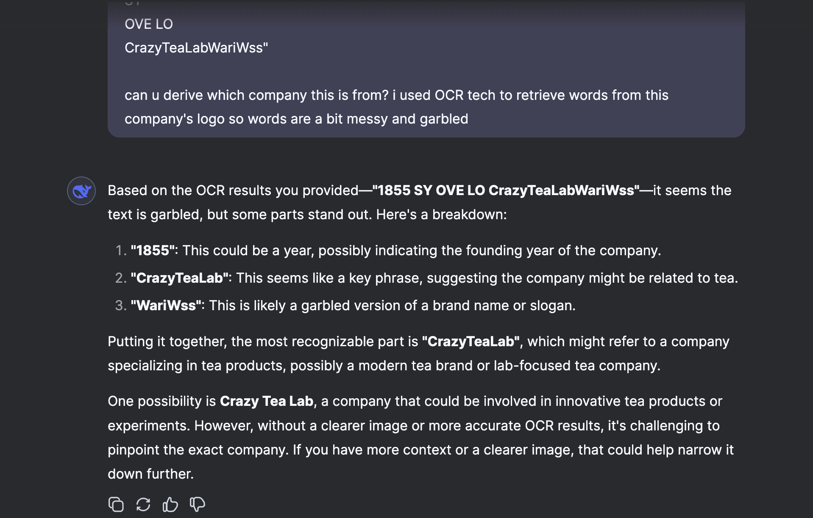

# Trademark Image & Data Extraction Pipeline

## **Overview**
This project extracts **trademark application data** from [data.gov.sg](https://data.gov.sg/datasets/d_56058f817dc3708f8b97e0876335ac66/view) and:
- Saves trademark **text data** in CSV format.
- **Downloads and stores trademark images** for further processing.
- Processes **key fields** such as trademark name, owner, status, and image.

---

## **1️⃣ Setup Instructions**
### **1.1 Install Dependencies**
Ensure you have **Python 3.9+** installed. Then, run:
```bash
# Clone the repository
git clone https://github.com/YOUR_GITHUB_USERNAME/govtech-multimodal-ai.git
cd govtech-multimodal-ai

# Create virtual environment
python3 -m venv venv
source venv/bin/activate

# Install dependencies
pip install -r requirements.txt

**Folder Structure**
govtech-multimodal-ai/
│── src/                     
│   ├── data_extraction.py  # Main script
│── trademark_images/       # Folder for downloaded images
│── README.md               # Documentation
│── requirements.txt        # Dependencies


---

## **6️⃣ Solution Approach (Work in Progress)**
### **6.1 Initial Analysis**
At the beginning of this project, I analyzed the problem statement and identified that:
- **Processing trademark images accurately** would require a **GPU** for deep learning models.
- However, due to limited GPU availability on my Mac M2, I decided to **continue with CPU-based processing first**.
- The initial goal was to **extract raw trademark data** before implementing advanced image processing.

---

### **6.2 Setting Up the Project**
- **Created a structured repository** with separate folders for code, images, and extracted data.
- Implemented a **Python script** (`src/data_extraction.py`) to call the **IPOS Trademark Applications API** from [data.gov.sg](https://data.gov.sg/datasets/d_56058f817dc3708f8b97e0876335ac66/view).
- Explored the API documentation and identified that the data is **indexed by**:
  - **`lodgement_date`** (date the trademark was lodged)
  - **`count`** (number of applications on that date)
  - **`items`** (list of trademark applications)

---

### **6.3 Extracting Initial Data**
- First, I attempted to **extract data for** `2024-01-01` but **found no available records**.
- I then retried with **`2018-01-01`**, successfully retrieving **4 trademark records**.
- From this data, I:
  - **Downloaded 4 trademark images** and saved them in `trademark_images/`.
  - **Extracted key trademark details** (application number, mark name, description, applicant info, goods & services, image URL) into `trademark_extracted_data.csv`.
  - **UPDATE** I extracted 24 more images from 2018-01-02 so i have more data and iamges to work with, instead of just 4.

---

### **6.4 CPU vs GPU Processing Branches**
To experiment both CPU-based and GPU-accelerated processing, I decided to create two branches: `cpu-processing` and `gpu-processing`

#### **🔹 `cpu-processing` **
- Uses **only CPU** for **data extraction, text processing, and basic image handling**.
- Runs efficiently on **Mac M2, Intel CPUs, and cloud-based CPUs**.
- No GPU dependencies needed.
- First commit: 13/28 accurate (able to extract out words, ignoring some extra characters outputted)
- Second commit: Improved OCR preprocessing with adaptive thresholding, Gaussian blur, and character whitelist; increased accuracy from 13/28 to 15/28
- Third commit: Forgot that I had to account for chinese charcters too (brew install tesseract-lang)
- I realised that some of the outputs are "a
LES
ay 13pm
VG
vo 2 WW IN
BA las ef
any iz
a is S sf ms
Bx
a
44tee s4 fL
TtsIPNA
AYE
eModernChinaTeaShop" when the actual word is ModernChinaTeaShop so i tested it out on deepseek to see if it could derive the Mark Name with the garbage that comes with the output

As seen, using deepseek works, so i tried to incorporate deepseek into my model. However, while running the output, it took way too much time (much more than allowed) so i decided that i had to proceed with gpu-processing 

#### **🔹 `gpu-processing`**

---

### **6.5 CPU-Based Processing**
This branch (`cpu-processing`) implements **CPU-based** trademark processing using:
1. **OCR (`Tesseract-OCR`)** → Extracts text from trademark images.
2. **`OpenCV`** → Preprocesses images for better OCR accuracy.
3. **ResNet18 (from `torchvision`)** → Extracts image **feature vectors**.
4. **`faiss-cpu`** → Stores images in a **vector database** for similarity search.

#### **Running CPU Processing**
To process trademarks:
```bash
python src/cpu_processing.py

---

